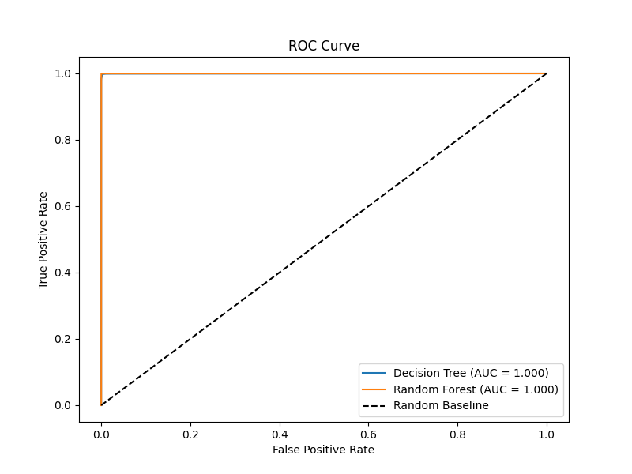

# Intrusion Detection System (IDS)

A machine learning-based pipeline for detecting malicious network traffic using supervised classification and unsupervised anomaly detection.

## Problem Statement
Network intrusion detection is the process of monitoring network traffic for suspicious activity and known threats. In an era of increasing cyberattacks, an effective IDS is critical for identifying unauthorized access, data breaches, and denial-of-service attempts before they cause significant damage to organizational infrastructure.

## Dataset
This project utilizes the **KDD Cup 99** dataset, a benchmark dataset for intrusion detection. It contains a wide variety of simulated network traffic, including both normal connections and various types of attacks (e.g., DoS, Probing, U2R, R2L).
- **Download:** The dataset can be obtained from the [UCI Machine Learning Repository](https://archive.ics.uci.edu/ml/datasets/kdd+cup+1999+data).
- **Content:** It consists of 41 features per connection record, including duration, protocol type, service, and various traffic statistics.

## Approach
We employ a hybrid approach to maximize detection capabilities:
1. **Decision Tree:** A baseline supervised model used for its interpretability and speed.
2. **Random Forest:** An ensemble method that reduces variance and improves accuracy by aggregating multiple decision trees.
3. **K-Means Clustering:** An unsupervised learning technique added to identify potential "zero-day" attacks—novel threats that do not match known signatures and would otherwise be missed by supervised models.

## Results

| Model | Accuracy | Precision | Recall | F1 Score |
| :--- | :--- | :--- | :--- | :--- |
| Decision Tree | 0.9977 | 0.9977 | 0.9977 | 0.9977 |
| Random Forest | 0.9996 | 0.9996 | 0.9996 | 0.9996 |

## Model Evaluation

### Cross Validation
| Model | Mean Accuracy | Std Deviation |
| :--- | :--- | :--- |
| Decision Tree | 0.9883 | ± 0.0187 |
| Random Forest | 0.9969 | ± 0.0059 |

Random Forest is ~3x more stable than Decision Tree (lower variance).

### ROC Curve
Both models achieved **AUC = 1.000**, indicating near-perfect class separation.




## How to Run
1. **Install Dependencies:**
   ```bash
   pip install pandas scikit-learn matplotlib seaborn
   ```
2. **Prepare Data:** Ensure `kddcup.data_10_percent.gz` is in the project root.
3. **Execute Pipeline:**
   ```bash
   python main.py --data kddcup.data_10_percent.gz --model both --report
   ```

## Live Attack Validation

### Test Setup
- Validation performed against a live Metasploitable VM (target) from a Kali Linux VM (attacker), using the scapy_capture.py live classification pipeline.
- Two ground-truth test scenarios were run in a single continuous capture session (sniff() modified from count=100 to count=0, timeout=180 to support a full test window), separated by a 10-second gap to avoid flow bleed given the 2-second flow aggregation window:
  1. Baseline normal traffic: a single curl request from Kali to Metasploitable.
  2. Attack traffic: an nmap SYN scan (-sS) against Metasploitable across 1000 ports.
- Metric used: recall on the ATTACK class (of all true attack flows, how many were correctly flagged), prioritized over plain accuracy since false negatives (missed attacks) are more costly than false positives in an IDS context.

### Bug Found: Service-Port Normalization Flaw
- Initial validation run showed 0/473 scan flows correctly flagged ATTACK (0% recall), despite the model performing at >99% accuracy in offline testing.
- Root cause: flow-key normalization sorts the bidirectional 5-tuple by (ip, port), which for this test topology consistently placed Kali's fixed ephemeral source port into one specific tuple slot. The same_srv_rate/diff_srv_rate calculations were reading directly from that fixed slot instead of resolving the true service-side port, causing same_srv_rate to be pinned at 1.00 and diff_srv_rate at 0.00 for every flow regardless of how many distinct ports were actually scanned.
- Fix: introduced a service_port variable using the same "check SERVICE_MAP on one port, fall back to the other" resolution logic already used for service-name lookup, and reused it consistently across the service, same_srv_rate, and diff_srv_rate calculations.

### Results After Fix
- Baseline (curl) flow: correctly predicted NORMAL.
- Attack (nmap SYN scan) flows: 375 of 377 correctly predicted ATTACK — 99.47% recall on the attack class, 0 false positives on the normal-traffic baseline.

### Remaining Misses: Architectural Explanation
- The 2 missed flows were both on ports mapping to the domain_u (DNS) service, with small byte counts (Src=60, Dst=112 and Src=60, Dst=58) typical of legitimate DNS traffic.
- Feature importance analysis of the trained Random Forest shows count (0.164), dst_bytes (0.135), and logged_in (0.124) as the top 3 features by weight.
- logged_in — along with 27 other payload-dependent or host-based KDD99 features — is hardcoded to 0 in the live pipeline (justified elsewhere in this README: modern traffic is largely encrypted, consistent with tools like Zeek). This means nearly 12% of the model's decision weight comes from a feature that never varies in live deployment.
- For these two specific flows, the service (domain_u) and dst_bytes (small, DNS-typical) both independently pointed toward NORMAL, and count alone wasn't sufficient to outweigh them. This is a genuine, documented model limitation rather than a pipeline bug — a small blind spot for scan probes that happen to route through DNS-mapped ports.

## Key Findings
Feature importance analysis revealed that specific traffic characteristics—such as `src_bytes`, `dst_bytes`, and `count`—are the primary indicators of malicious activity. These features allow the models to distinguish between benign traffic and common attack patterns with high reliability.

## Limitations and Future Work
- **Static Signatures:** The supervised models are limited to detecting known attack types; they cannot inherently identify new, evolving threats without retraining.
- **Data Imbalance:** The dataset is highly imbalanced, which can bias the models toward the majority class (normal traffic). Future work should include techniques like SMOTE (Synthetic Minority Over-sampling Technique) to improve detection of rare attack types.
